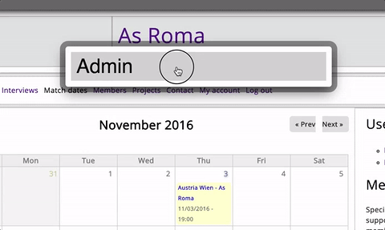
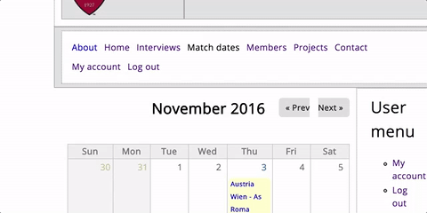
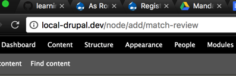

# Report


Mike Jakobsen
URL: http://www.mikejakobsen.com/drupal

[Github.com/mikejakobsen](http://www.github.com/mikejakobsen)
[Dribbble.com/mikejakobsen](http://www.dribbble.com/mikejakobsen)
[Twitter.com/mikejakobsen](http://www.twitter.com/mikejakobsen)

Login

| User               | Password |
|--------------------|----------|
| mike               | secret   |


## Summary
* Drupal
* Drupal vs andre CMS systemer
* Extra module
 * Facebook
* Theme

## Drupal

## Drupal vs andre CMS systemer

## Extra moduler

Drupal er relativt minimalisk opbygget. Grundet den minimalistiske opbygning er moduler bredt anvendt for at udvide Drupals funktionalitet.

### Facebook

Jeg integrerede et Facebook-login grundet Facebook generelle udbredelse. Da Facebook pr. 2016 har  3.476.000 månedlige danske brugere. Samt det faktum at op i mod 62% af den danske befolkning benytter Facebook [dagligt](http://www.socialemedier.dk/sociale-medier-2016-i-danmark/). Formoder jeg at Facebook er ret udbredt hos de besøgende brugere, derfor vurderede jeg at inkluderingen af muligheden for at logge ind via den enkeltes Facebook login, i stedet for at skulle oprette en bruger, som essentiel.

Ligeledes tillader Facebook muligheden for at tilgå brugerens profilbillede, og dermed evt. vise det på siden. En funktion der eventuelt senere kunne tilføjes.

For at integrere Facebook benyttes [Facebook SDK v. 4.0.23.](https://github.com/mikejakobsen/learning-drupal/tree/master/sites/all/libraries) [Facebook SDK](https://github.com/facebook/php-graph-sdk) er en open source PHP Development Kit, der gør integrationen af Facebooks Platform med PHP nemmere. I forlængelse af Facebook SDK benyttes et [Drupal Module](https://www.drupal.org/project/simple_fb_connect) der agerer rapper med den førnævnte SDK, og dermed gør det muligt at tilgå den via Drupal applikationen.

Modulet sammenligner dernæst e-mailen anvendt til Facebook profilen. Hvis Drupal applikationen allerede har en bruger med den pågældende email, bliver denne bruger dernæst logget ind. Ellers bliver en ny bruger tilføjet. Dernæst bliver brugeren billede gemt i *sites/default/files/pictures*. Modsat de fleste andre Facebook Login løsninger der ofte undlader at gemme profil billede, men derimod blot tilgår billederne via deres URL, der så bliver gemt i databasen.

```SQL
  SELECT
      *
  FROM
      users
```
### Users Table

| uid | name         | pass                                                    | mail                                  | theme | signature | signature_format | created    | access     | login      | status | timezone      | language | picture | init              | data                       |
|-----|--------------|---------------------------------------------------------|---------------------------------------|-------|-----------|------------------|------------|------------|------------|--------|---------------|----------|---------|-------------------|----------------------------|
| 1   | mike         | $S$DbON4.JDjSrdaELOslNUwJN9/6Id/V/XWbNRk.ORw26QWPQRFot5 | mike@jakobsen.dk                      |       |           | NULL             | 1477826754 | 1479130717 | 1479119429 | 1      | Europe/Berlin |          | 0       | mike@jakobsen.dk  | b:0;                       |
| 41  | Martin Hjord | $S$DwBTippt6EmUvz2jNkPhiAYoULIBwYsdS9/ADRl.dJZT4kXzthA1 | hjorden@gmail.com                     |       |           | filtered_html    | 1479120328 | 1479120758 | 1479120492 | 1      |               |          | 45      | hjorden@gmail.com | a:1:{s:7:\contact\";i:1;}" |


### Coffee


G
For at gøre Drupal applikationen nemmere at navigere. Benytter jeg indvidere Coffee modulet. Coffee modulet gør det muligt at navigere Drupals backend via tastaturet. Udvikleren Michael Moi lavede Coffee med inspiration fra Alfred til OSX, der gør det muligt at navigere computeren, via tastaturet. [Kilde](https://dev.acquia.com/blog/drupal-8-module-of-the-week/drupal-8-module-of-the-week-coffee/12/04/2016/10291)
Coffee skaber en lignende funktion ved at aktivere Coffee via *Alt+d*. For dernæst at skrive hvilken  funktionalitet,  eller kvillket sted i applikationen man ønsker at tilgå.



Oprindeligt søgte jeg en lignende interface, ved at tilgå URL'en der angiver den tilsvarende funktion. At tilgå */node/add/match-review*, vil dermed være det samme at.

    Content - Add Content - Match Review



## Theme

For at bryde med det generiske udseende som pryder Bartik temaet. Benytter jeg en [boilerplate](https://www.drupal.org/project/boilerplate) til et theme. En boilerplate skal i denne sammenhæng forståes som et meget minimalistisk tema. Der dermed er nemmere at modificere.

[Theme Dir](https://github.com/mikejakobsen/learning-drupal/tree/master/sites/all/themes/boilerplate)

    block.tpl.php
    comment.tpl.php
    html.tpl.php
    node.tpl.php
    page.tpl.php

