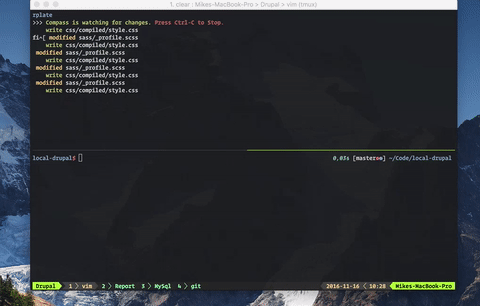

# Report


Mike Jakobsen
URL: http://www.mikejakobsen.com/drupal

## Login

| User               | Password |
|--------------------|----------|
| mike               | secret   |


## Summary

* Drupal
* Drupal vs andre CMS systemer
* Drush
* Extra module
 * Facebook
 * Coffee
 * NoCache
 * Scheduler
* Theme

# Drupal vs Umbraco

### Content creation

Anskuer man Drupal og [Umbraco](https://github.com/umbraco/Umbraco-CMS), fra en *daily users* perspektiv. Udmærker Umbraco sig på en række punkter. Da interfacen i høj grad er målrettet den almene brugere, og dermed ikke kræver tekniske forudsætninger for at benytte interfacen. Den gængse bruger vil blive tilknyttet brugertypen *writer* og dermed tilgå en interface der i højgrad ligner gængse applikationer som Microsoft Word og interfacer de møder i deres daglige ageren med en computer.

Umbraco tillader endda at importere rå *.docx* dokumenter fra [Microsoft Word](https://our.umbraco.org/projects/collaboration/import-ms-word-document/), dermed behøver brugeren nærmest ikke at interagere med Umbraco, men kan derimod nøjes med at tilgå allerede familiære programmer som her, Microsoft Word.


Anskuer man derimod Drupal fra en *daily users* perspektiv. Kan Drupal derimod godt opleves mangelfuld, da selv det at oprette og administrere *dagligt indhold*. Kan kræve en grundlæggende forståelse for [HTML formattering](http://www.mikejakobsen.com/drupal/filter/tips#overlay-context). Da brugeredn tilgår simple tekstfelter, der ikke har mulighed for umiddelbar formattering, denne formatering; kræver derimod en grundlæggende forståelse for HTML. En integration af [TinyMCE](https://www.drupal.org/project/wysiwyg) eller lignende, er dermed påkrævet for at give brugeren den mulighed. Dog kan det påpeges at store selskaber som [JYSK](www.jysk.dk), [TV 2 Sporten](www.tv2sporten.dk) og [Berlingske](www.berlingske.dk). Kilde: [Novicell](https://www.novicell.dk/hvad-kan-vi/softwareudvikling/cms-platforme/drupal).

Dog udmærker Drupal sig ved muligheden for selv at udvikle tema til administrationsdelen, og dermed fremhæve funktionalitet i designet, hvis brugeren primært skal tilgå.

Anskuer man dermed de to CMS'er under den antagelse, at de skal benyttes af en mellem-stor til stor virksomhed. Vil Umbraco dermed klart være at foretrække.

### Metadata

I forhold til *metadata*, som i denne sammenhæng skal forståes som selve kollokationer, og dermed en merværdi man selv tilføjer indholdet. 

[James, Kalback]<a name="kalbach">1</a>: “By attaching metadata to the [..] content, finding it becomes easier.”

*This also includes keyword indexes, subject taxonomies and topic maps.*

<sup>[1](#kalbach)</sup>

### Extendability

For at tilpasse det enkelte CMS til den enkelte side, benyttes der ofte en række plugins. For at tilføje funktionalitet, eller tilpasse allerede eksisterende funktionalitet.
Her udmærker Drupal sig, grundet et større open source community. Har Drupal en del flere  [modules](https://www.drupal.org/project/project_module), og dermed er det væsentlig nemmere at tilknytte mere funktionalitet til ens Drupal installation. Kontrær Umbraco, der har et relativt lille udbud af [Umbraco Plugins](https://our.umbraco.org/projects/). Dermed vil tilføjelsen af funktionalitet, i høj grad være begrænset til udviklerens kompetencer.
Dermed formoder jeg at Umbraco, er knap så tilgængeligt for den gængse bruger, da funktionaliteten den enkelte måske påkræver ikke allerede findes, i form af et plugin.

### Opbygningen

Grundlæggende differencerer Umbraco og Drupal, sig på en række punkter rent teknisk. Da Umbraco er baseret på C# samt webforms i begyndelsen, siden version 4.11 har Umbraco dog været baseret på Asp.net MVC. Hvorimod Drupal er baseret på PHP.

Ligeledes er den gængse opbygning af Drupal og Umbraco bruger genererede indhold radikalt forskelligt.

Umbracos grundlæggende *markup* og dermed layout, er baseret på en [Razor](https://www.asp.net/web-pages/overview/getting-started/introducing-razor-syntax-c) template, og dermed en *.cshtml* der gør det muligt at inkorporere *server-side* kode, og dermed variabler eller deslige fra backend delen.

*Document Typen* i Umbracos backend definerer dernæst hvilke *properties* der benyttes til den gågældende layout template.

I forlængelse af det, er Drupal baseret på en *content-type* i backend delen der definerer det enkelte indhold. Ud fra denne *content-type* defineres dernæst indhold, matchende den pågældende *content-type*. Der dermed agerer *model* for det pågældende indhold.

I forhold til layoutet, og *markup* af dette indhold adskiller Drupal sig en del fra Umbraco. Da *markup* og dermed layoutet for Drupal defineres af det enkelte tema, og dermed en *tpl.php* fil i temaet.

### Recap

Sammenligner man Drupal og Umbraco differencierer de sig på en række punkter. Drupal er baseret på [PHP](http://php.net/) hvorimod Umbraco er baseret på C# og [.NET](https://www.microsoft.com/net).
Drupal er dermed baseret på Lamp-stack (Linux, Apache, MySQL, PHP).
*NB: Linux og Apache er ikke et krav, men det generelt anvendte*

Abstrakt set er Umbraco Open-Source. Men da Umbraco er baseret på en server løsning, bestående af Windows, IIS, MS-SQL. Der alle er Microsoft produkter, og dermed kræver en Licens. Anser jeg ikke Umbraco for 100% Open Source.

Grundlæggende set vil valget mellem Drupal og Umbraco dermed være baseret på valget mellem Lamp-stack/PHP eller en *tech-stack* bestående af IIS, MS-SQL. Dermed vil der være flere driftmæssige omkostninger ved sidst nævnte *tech-stack*.

I forhold til Drupal 7.52 som jeg benytter opstår der dog en problematik, da mange moduler ikke længere understøtter Drupal [7.52](https://www.drupal.org/project/drupal/releases/7.52). Til trods for at Drupal 7.x stadig er mere udbredt end Drupal 8.x. Med 1,062,563 registrerede sider pr. [November 12, 2016](https://www.drupal.org/project/usage/drupal). Kontra Drupal 8.x med 120,530 registrerede brugere.


## Drush

[Drush](https://drushcommands.com/drush-7x/) er en command-line interface, der gør det muligt at interagere med Drupal installationen. Hvor i mod Drupals egen command-line tool primært er til at install samt scaffolde din Drupal applikation.

[Drush](https://packagist.org/packages/drush/drush) installeres via PHP dependency manageren [Composer](https://getcomposer.org/). Drush gør det for eksempel muligt at download samt aktivere Drupal moduler direkte fra command-line.

```bash
drush dl modulename
drush en -y modulename
```
*NB: -y betyder at alle prompts bliver bekræftet med yes*

### Opret ny bruger

```bash
drush user-create Mike --mail="mike@jakobsen.dk" --password="secret"
```
### Clear Cache


### Backup af databasen


## Extra moduler

Drupal er relativt minimalisk opbygget. Grundet den minimalistiske opbygning er moduler bredt anvendt for at udvide Drupals funktionalitet.

### Facebook

Jeg integrerede et Facebook-login grundet Facebook generelle udbredelse. Da Facebook pr. 2016 har  3.476.000 månedlige danske brugere. Samt det faktum at op i mod 62% af den danske befolkning benytter Facebook [dagligt](http://www.socialemedier.dk/sociale-medier-2016-i-danmark/). Formoder jeg at Facebook er ret udbredt hos de besøgende brugere, derfor vurderede jeg at inkluderingen af muligheden for at logge ind via den enkeltes Facebook login, i stedet for at skulle oprette en bruger, som essentiel.

Ligeledes tillader Facebook muligheden for at tilgå brugerens profilbillede, og dermed evt. vise det på siden. En funktion der eventuelt senere kunne tilføjes.

For at integrere Facebook benyttes [Facebook SDK v. 4.0.23.](https://github.com/mikejakobsen/learning-drupal/tree/master/sites/all/libraries) [Facebook SDK](https://github.com/facebook/php-graph-sdk) er en open source PHP Development Kit, der gør integrationen af Facebooks Platform med PHP nemmere. I forlængelse af Facebook SDK benyttes et [Drupal Module](https://www.drupal.org/project/simple_fb_connect) der agerer rapper med den førnævnte SDK, og dermed gør det muligt at tilgå den via Drupal applikationen.

Modulet sammenligner dernæst e-mailen anvendt til Facebook profilen. Hvis Drupal applikationen allerede har en bruger med den pågældende email, bliver denne bruger dernæst logget ind. Ellers bliver en ny bruger tilføjet. Dernæst bliver brugeren billede gemt i *sites/default/files/pictures*. Modsat de fleste andre Facebook Login løsninger der ofte undlader at gemme profil billede, men derimod blot tilgår billederne via deres URL, der så bliver gemt i databasen.

```SQL
  SELECT
      *
  FROM
      users
```
### Users Table

| uid | name         | pass                                                    | mail                                  | theme | signature | signature_format | created    | access     | login      | status | timezone      | language | picture | init              | data                       |
|-----|--------------|---------------------------------------------------------|---------------------------------------|-------|-----------|------------------|------------|------------|------------|--------|---------------|----------|---------|-------------------|----------------------------|
| 1   | mike         | $S$DbON4.JMjSrdaELOslNUwJN9/6Id/V/XWbNRk.ORw26QWPQRFot5 | mike@jakobsen.dk                      |       |           | NULL             | 1477826752 | 1479130719 | 1479119422 | 1      | Europe/Berlin |          | 0       | mike@jakobsen.dk  | b:0;                       |
| 41  | Martin Hjord | $S$DwBTippl6FmUvz2jNkPhiAYoULIBwYsdS9/ADRl.dJZT4kXzthA1 | hjorden@gmail.com                     |       |           | filtered_html    | 1479120325 | 1479120752 | 1479120493 | 1      |               |          | 45      | hjorden@gmail.com | a:1:{s:7:\contact\";i:1;}" |


### Coffee


G
For at gøre Drupal applikationen nemmere at navigere. Benytter jeg indvidere Coffee modulet. Coffee modulet gør det muligt at navigere Drupals backend via tastaturet. Udvikleren Michael Moi lavede Coffee med inspiration fra Alfred til OSX, der gør det muligt at navigere computeren, via tastaturet. [Kilde](https://dev.acquia.com/blog/drupal-8-module-of-the-week/drupal-8-module-of-the-week-coffee/12/04/2016/10291)
Coffee skaber en lignende funktion ved at aktivere Coffee via *Alt+d*. For dernæst at skrive hvilken  funktionalitet,  eller kvillket sted i applikationen man ønsker at tilgå.


Oprindeligt søgte jeg en lignende interface, ved at tilgå URL'en der angiver den tilsvarende funktion. At tilgå */node/add/match-review*, vil dermed være det samme at.

    Content - Add Content - Match Review


### NoCache

Cacheing er en stor del af et CMS som Drupal, for at applikationen kan interagere samt loades hurtigere af brugeren. I forbindlese  med udviklingen af siden, har en konstante cacheing dog en række ulemper. Da udvikleren kan blive præsenteret for gammel cached indhold.

[NoCache](https://www.drupal.org/project/nocache) er et module, der gør det muligt at deaktivere den konstante cacheing af indholdet, under udvikling. NoCache aktiveres via Drush.



### Scheduler

[Scheduler](https://www.drupal.org/project/scheduler) gør det muligt at tilretteligge indlæg på siden, så administratoren kan planlægge kommende events, som fx. en shoppingside der på forhånd vil tilrettelægge en kampagne målrettet Black Friday den 25. november.

Scheduler tilføjer dermed muligheden for at tilføje en *udgivelses-dato* til indhold.


## Theme

For at bryde med det generiske udseende som pryder Bartik temaet. Benytter jeg en [boilerplate](https://www.drupal.org/project/boilerplate) til et theme. En boilerplate skal i denne sammenhæng forståes som et meget minimalistisk tema. Der dermed er nemmere at modificere.

[Theme Dir](https://github.com/mikejakobsen/learning-drupal/tree/master/sites/all/themes/boilerplate)

Drupal er baseret på en række layout filer. Disse template filer, kan overskrives via *tpl.php* filer i templates mappen.
[html.tpl.php](https://github.com/mikejakobsen/learning-drupal/blob/master/sites/all/themes/boilerplate/templates/html.tpl.php) definerer det overordnede layout, og dermed den overordnede HTML template.

```php
  <head>
    <?php print $head; ?>
    <title><?php print $head_title; ?></title>
    <?php print $styles; ?>
    <?php print $scripts; ?>
  </head>
```

* [block.tpl.php](https://github.com/mikejakobsen/learning-drupal/blob/master/sites/all/themes/boilerplate/templates/block.tpl.php)
* [comment.tpl.php](https://github.com/mikejakobsen/learning-drupal/blob/master/sites/all/themes/boilerplate/templates/comment.tpl.php)
* [html.tpl.php](https://github.com/mikejakobsen/learning-drupal/blob/master/sites/all/themes/boilerplate/templates/html.tpl.php)
* [node.tpl.php](https://github.com/mikejakobsen/learning-drupal/blob/master/sites/all/themes/boilerplate/templates/node.tpl.php)
* [page.tpl.php](https://github.com/mikejakobsen/learning-drupal/blob/master/sites/all/themes/boilerplate/templates/page.tpl.php)

## User Profile
[user-picture.tpl.php](https://github.com/mikejakobsen/learning-drupal/blob/master/sites/all/themes/boilerplate/templates/user-picture.tpl.pho)
[user-profile-tpl.php](https://github.com/mikejakobsen/learning-drupal/blob/master/sites/all/themes/boilerplate/templates/user-profile.tpl.php)

### Overriding Theme templates

For at overføre enkelte variabler til enkelte content-types. Defineres en [preprocess hook](https://api.drupal.org/api/drupal/includes!theme.inc/function/template_preprocess/7.x) hvis primære rolle er at definere hvilke variabler den enkelte template skal have mulighed for at tilfå [preprocess_node](https://github.com/mikejakobsen/learning-drupal/blob/56003485ebae05abb3c6f8459a34baa83418b908/sites/all/themes/boilerplate/template.php#p3) herunder definerer dermed variablerne tilknyttet [node.tpl.php](https://github.com/mikejakobsen/learning-drupal/blob/master/sites/all/themes/boilerplate/templates/node.tpl.php) templaten.

```php
	function boilerplate_preprocess_node(&$vars) {
		if ($vars['type'] == 'article' or 'interview') {
			$node = $vars['node'];

			$vars['name'];

			$vars['submitted_day'] = format_date($node->created, 'custom', 'j');
			$vars['submitted_month'] = format_date($node->created, 'custom', 'M');
			$vars['submitted_year'] = format_date($node->created, 'custom', 'Y');
		}
	}
```
I eksemplet her ændres dato formatteringen på *artiklerne* samt *interviews* så den tilsvarer den gængse danske formatering. Via  Drupals [format_date](https://api.drupal.org/api/drupal/includes!common.inc/function/format_date/) funktion.  De tre variabler tilgåes dernæst på [node.tpl.php](https://github.com/mikejakobsen/learning-drupal/blob/master/sites/all/themes/boilerplate/templates/node.tpl.php#L22) templaten.

```php
format_date($timestamp, $type = 'medium', $format = '', $timezone = NULL, $langcode = NULL)
```


### KPR
En af de mest anvendte *drupal funktioner* ved udarbejdelsen af et theme. Er [KPR](https://api.drupal.org/api/devel/devel.module/function/kpr/7.x-1.x) funktionen.
Der i ligmed med [var_dump();](http://php.net/manual/en/function.var-dump.php) funktionen i almen PHP, printer den valgte variable, eller array. For at klarligge hvad elementet indeholder, og dermed finde det ønskede object, man ønsker angivet på siden.

```php
	function kpr($input, $return = FALSE, $name = NULL) {
	   return kprint_r($input, $return, $name);
	}
```
For at visualisere alle variabler tilknyttet node templaten.
Kan *kpr($vars);* dermed benyttes i *preprocess_node(&$vars)* hooken.


```php
	function boilerplate_preprocess_node(&$vars) {
	   // For at printe alle værdier i $vars
	   kpr($vars);
	}
```

